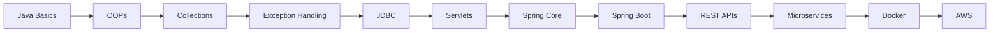

<div align="center">


[](https://git.io/typing-svg)

<br>


</div>

---

<div align="center">


</div>

---

# 💫 About Me


🎓 Computer Science Graduate  
💼 Associate Software Engineer at Accenture  
☕ Java Full Stack Developer  
🌱 Currently Learning Spring Boot & Microservices  
🚀 Passionate About Backend Development  
📚 Strong Interest in DSA & Problem Solving  
⚡ Love Building Scalable Applications  
🔥 Exploring Cloud & System Design  
🎯 Goal: Become a Skilled Backend Engineer  

<br><br><br>

---


# 🌐 Connect With Me

<div align="center">

<a href="https://www.linkedin.com/in/naveenk-s/">

</a>

<a href="mailto:nks990217@gmail.com">

</a>

<a href="https://github.com/Nksnaveenks">

</a>

</div>

---


# 💻 Tech Stack

<div align="center">

### 👨‍💻 Languages


---

### ⚙️ Backend & Frameworks


---

### ☁️ Tools & Platforms


</div>

---


# 🧠 Currently Exploring

```diff
+ Spring Boot
+ REST APIs
+ Microservices Architecture
+ JWT Authentication
+ Docker
+ AWS Basics
+ CI/CD Basics
+ System Design
```

---

# 🚀 Featured Projects

<div align="center">

| 🚀 Project | 💡 Description | ⚡ Tech Stack |
|---|---|---|
| Employee Management System | CRUD based employee system | Java, Spring Boot, MySQL |
| E-Commerce Backend API | REST APIs for shopping app | Spring Boot, JWT |
| Student Management System | Full CRUD operations | Java, MySQL |
| Portfolio Website | Personal responsive portfolio | HTML, CSS, JS |
| Banking Application | Secure banking operations | Java |
| Microservices Learning Project | API Gateway & Eureka setup | Spring Cloud |

</div>

---


# 📊 GitHub Analytics

<div align="center">


</div>

---

# 🔥 GitHub Streak Stats

<div align="center">


</div>

---

# 📈 Contribution Graph

<div align="center">

[](https://github.com/Nksnaveenks)

</div>

---

# 🏆 GitHub Achievements

<div align="center">


</div>

---

# 🐍 Contribution Snake

<div align="center">


</div>

---


# ☕ Java & Spring Boot Journey

<div align="center">



</div>

---

# 🧠 Coding Profiles

<div align="center">

<a href="https://leetcode.com">

</a>

<a href="https://hackerrank.com">

</a>

<a href="https://codechef.com">

</a>

</div>

---


# ✍️ Random Dev Quote

<div align="center">


</div>

---

# 😂 Random Developer Joke

<div align="center">


</div>

---

# 🎵 Spotify Playing

<div align="center">

[](https://open.spotify.com/)

</div>

---

# 🚀 Current Goals - 2026

✅ Master Spring Boot  
✅ Learn Microservices Architecture  
✅ Build Full Stack Projects  
✅ Improve Problem Solving Skills  
✅ Learn Docker & AWS  
✅ Contribute to Open Source  
✅ Become Backend Specialist  

---

<div align="center">

## 💻 “Code. Learn. Build. Repeat.”


</div>
