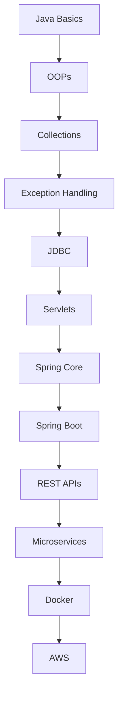

<div align="center">


<br>


<br><br>


<br><br>

<table>
<tr>
<td align="center" width="33%">


</td>

<td align="center" width="33%">


</td>

<td align="center" width="33%">


</td>
</tr>
</table>

<br>


<br><br>


<br><br>

<p align="center">


</p>

<br>


</div>

---

# 🚀 Developer Banner

<div align="center">

<table>
<tr>
<td width="45%">


</td>

<td width="55%">

```java
import java.time.LocalDate;

public class PositiveMessage {

    public static void main(String[] args) {

        String message = "Believe in yourself and all that you are.";

        System.out.println("╔══════════════════════════════════════╗");
        System.out.println("║         ✨ POSITIVE MESSAGE ✨       ║");
        System.out.println("╠══════════════════════════════════════╣");
        System.out.println("║ " + message + " ║");
        System.out.println("║                                      ║");
        System.out.println("║ Keep learning. Keep growing. 🚀      ║");
        System.out.println("║ You are your only limit! 💪          ║");
        System.out.println("╚══════════════════════════════════════╝");

        System.out.println();
        System.out.println("Code. Build. Innovate. Repeat.");
    }
}
```

</td>
</tr>
</table>

</div>

---

# 👨‍💻 About Me


🎓 Computer Science Graduate  
💼 Associate Software Engineer at Accenture  
☕ Passionate Java Full Stack Developer  
🚀 Learning Spring Boot & Microservices  
📚 DSA & Competitive Programming Enthusiast  
⚡ Love Backend Engineering & APIs  
🔥 Exploring Docker, AWS & Cloud Technologies  
🎯 Goal: Become Enterprise Java Architect  

<br><br><br>

---

# 🌐 Connect With Me

<div align="center">

<a href="https://www.linkedin.com/in/naveenk-s/">

</a>

<a href="mailto:nks990217@gmail.com">

</a>

<a href="https://github.com/Nksnaveenks">

</a>

</div>

---

# ⚔️ Tech Stack

<div align="center">

### 👨‍💻 Languages


<br><br>

### ⚙️ Backend & Databases


<br><br>

### ☁️ Tools & Platforms


</div>

---

# 🚀 Currently Exploring

<div align="center">


</div>

---

# 🚀 Featured Projects

<div align="center">

| 🚀 Project | 💡 Description | ⚡ Tech |
|---|---|---|
| Employee Management System | CRUD employee management system | Spring Boot, MySQL |
| E-Commerce Backend API | JWT secured REST APIs | Spring Boot |
| Banking Application | Banking operations management | Java |
| Portfolio Website | Responsive developer portfolio | HTML, CSS, JS |
| Student Management System | Student record management | Java, MySQL |
| Microservices Project | API Gateway & Eureka Server | Spring Cloud |

</div>

---

# 📊 GitHub Analytics

<div align="center">


</div>

<br>

<div align="center">


</div>

---

# 📈 Contribution Graph

<div align="center">

[](https://github.com/Nksnaveenks)

</div>

---

# 🏆 GitHub Achievements

<div align="center">


</div>

---

# 🐍 Contribution Snake

<div align="center">


</div>

---

# ☕ Java Developer Roadmap

<div align="center">



</div>

---

# 🧠 Coding Profiles

<div align="center">

<a href="https://leetcode.com">

</a>

<a href="https://hackerrank.com">

</a>

<a href="https://codechef.com">

</a>

</div>

---

# ✨ Developer Philosophy

<div align="center">


</div>

---

# 🚀 Goals For 2026

✅ Master Spring Boot  
✅ Learn Microservices Architecture  
✅ Build Enterprise Applications  
✅ Learn Docker & AWS  
✅ Improve DSA Skills  
✅ Become Backend Specialist  
✅ Contribute To Open Source  

---

<div align="center">

# ⚡ “Code. Learn. Build. Repeat.”


</div>
