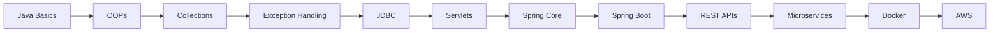

 

  

  

---

# 🌌 Welcome To My Digital Space 🌌

# 💫 About Me

🎓 Computer Science Graduate  
💼 Associate Software Engineer at Accenture  
☕ Passionate Java Developer  
🚀 Learning Spring Boot & Microservices  
📚 DSA & Problem Solving Enthusiast  
⚡ Backend Engineering Lover  
🔥 Exploring Cloud, Docker & AWS  
🎯 Goal: Become Enterprise Java Architect  

   

---

# 🌐 Connect With Me

---

# 💻 Tech Arsenal

### 👨‍💻 Languages

  

### ⚙️ Frameworks & Databases

  

### ☁️ Tools & Platforms

---

# 🧠 Currently Learning

---

# 🚀 Featured Projects

| 🚀 Project | 💡 Description | ⚡ Tech |
|---|---|---|
| Employee Management System | Full CRUD employee management | Spring Boot, MySQL |
| E-Commerce Backend API | REST APIs with JWT security | Spring Boot |
| Student Management System | Student database management | Java, MySQL |
| Banking Application | Banking operations system | Java |
| Portfolio Website | Personal developer portfolio | HTML, CSS, JS |
| Microservices Project | API Gateway & Eureka setup | Spring Cloud |

---

# 📊 GitHub Analytics

 

---

# 📈 Contribution Graph

---

# 🏆 GitHub Achievements

---

# 🐍 Contribution Snake

---

# ☕ Java Learning Roadmap

---

# 🧠 Coding Profiles

---

# ✨ Developer Quote

---

# 🚀 Goals For 2026

✅ Master Spring Boot  
✅ Learn Microservices Architecture  
✅ Build Enterprise Level Applications  
✅ Learn Docker & AWS  
✅ Improve DSA Skills  
✅ Become Backend Specialist  
✅ Contribute To Open Source  

---

# 💻 “Code. Create. Innovate. Repeat.”

